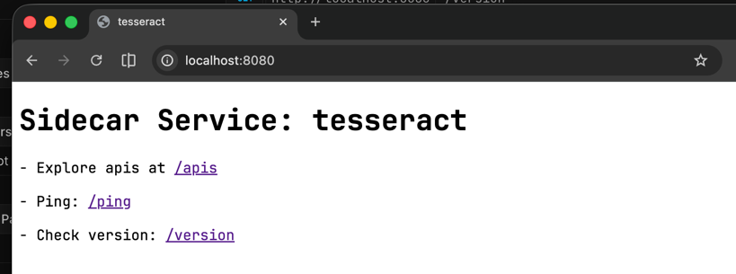
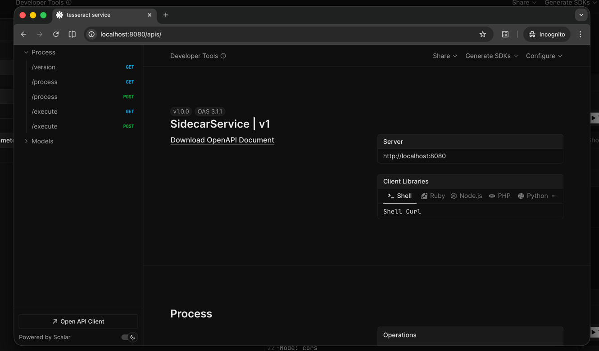

# Build image

## Examples





## Tesseract Ocr

```shell
docker build --platform linux/amd64 -t docker-registry.hoang.id/tesseract-ocr-server:latest -f ./Sidecars/TessaractOcr/Dockerfile .

docker push docker-registry.hoang.id/tesseract-ocr-server:latest
```

# Usage

## Common

- Define process name (e.g `tesseract`)
- Define command to get process version (e.g `[Name] -v)
  - `[Name]` will be resolved automatically as `tesseract`
- Define the default command to process on files (e.g `[Name] -process [FilePath]`)
  - `[Name]` will be resolved automatically as `tesseract`
  - `[FilePath]` will be resolved automatically as provided via APIs (`/process`)

## Environment variables

```shell
# The data folder path (optional, default is /app/data) 
Sidecar_DataFolderPath=/app/data

# The maximum number of processes can run in parallel (optional, default is 5)
Sidecar_Queue__MaxParallelism=5

# The process name (required)
Sidecar_Process__Name=
# The default command to process on files (required)
Sidecar_Process__Command=
# The command to get version of process (required)
Sidecar_Process__VersionCommand=

# The timeout on each process on file (optional, default is 15 seconds)
App_Process__Timeout="0:00:15"
# The number of retries if process on file is failed (optional, default 4 times with [300ms, 500ms , 1s, 5s])
Sidecar_Process__Retries=[ 300, 500, 1000, 5000 ]
```

## Tesseract Ocr

```yaml
services:
  tesseract-ocr-server:
    container_name: tesseract-ocr-server
    image: docker-registry.hoang.id/tesseract-ocr-server:latest
    ports:
      - 8080:8080
    volumes:
      - ./data:/app/data
    environment:
      - Sidecar_Process__Name=tesseract
      - Sidecar_Process__VersionCommand=[Name] -v
      - Sidecar_Process__Command=[Name] [FilePath] - l eng --psm 3 -c tessedit_char_whitelist='abcdefghijklmnopqrstuvwxyzABCDEFGHIJKLMNOPQRSTUVWXYZ0123456789.-/ '#
```
